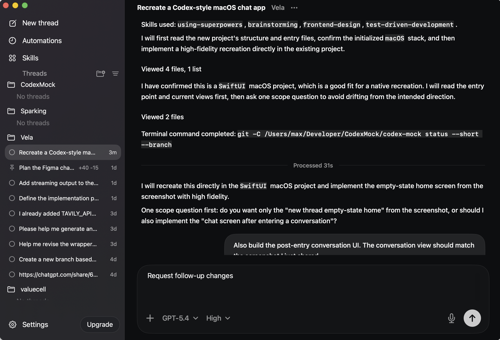

# Codex Mock

A SwiftUI macOS mock application that recreates a Codex-style desktop chat interface, including the sidebar, conversation surface, and composer interactions.

## Screenshot



## Project Structure

- `codex-mock/`: SwiftUI app source files
- `Tests/`: lightweight validation programs for shell appearance and state
- `assets/`: screenshots and repository assets

## Run

Open the project in Xcode:

```bash
open codex-mock.xcodeproj
```

Or build from the command line:

```bash
xcodebuild -project codex-mock.xcodeproj -scheme codex-mock -sdk macosx -configuration Debug build
```

## Notes

- The UI is driven by local mock data rather than a live backend.
- The project is intended as a high-fidelity visual mock, not a production chat client.
